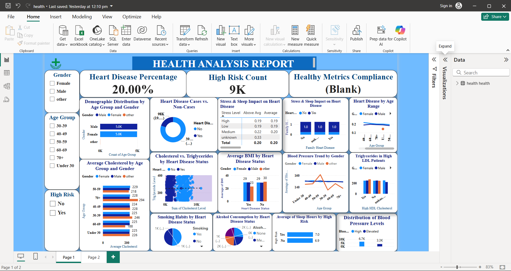

# 🩺 Health Power BI Dashboard

## 🚀 Project Highlights

- ✅ Built using **Power BI Desktop**
- ✅ Clean and intuitive user interface for quick insights
- ✅ Designed with **real-world analytics** in mind
- ✅ Emphasizes **data storytelling**, not just visuals

## 📊 Key Features & Insights

- **Patient Demographics**  
  Visual breakdown by age, gender, and region

- **Medical Trends**  
  Most common diagnoses, conditions, and treatments

- **Hospital Performance**  
  Admissions, discharges, and treatment timelines

- **Time Series Analysis**  
  Monthly trends in treatments, outcomes, or visits

- **Interactive Filters**  
  Slicers for department, time period, gender, and more

## 💼 Skills Demonstrated

- 📌 Data modeling using Power BI
- 📌 DAX functions for dynamic calculations
- 📌 Data cleaning and transformation using Power Query
- 📌 Report design best practices for clear storytelling
- 📌 KPI tracking and conditional formatting

## 🛠 How to Use

1. Download the `.pbix` file from this repository.
2. Install [Power BI Desktop](https://powerbi.microsoft.com/desktop) if you don't have it.
3. Open the file in Power BI Desktop and explore the visuals.

## 📷 Screenshot

## 📢 About the Project

This dashboard was created as part of a portfolio to demonstrate my ability to translate raw healthcare data into **actionable business intelligence**. It can be adapted to any real-world hospital system or public health dataset.

